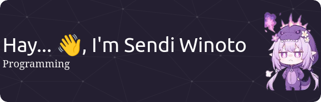

  

#####
<picture>
  <source media="(prefers-color-scheme: dark)" srcset="https://raw.githubusercontent.com/senshiner/senshiner/output/pacman-contribution-graph-dark.svg">
  <source media="(prefers-color-scheme: light)" srcset="https://raw.githubusercontent.com/senshiner/senshiner/output/pacman-contribution-graph.svg">
  
</picture>

#####

#### 🌐 Socials:
  

#### 💻 Tech Stack:

#####

  

  <h2>🎧 Now Playing on Spotify 🎵</h2>
  

    
  

#### 📊 GitHub Stats:
 